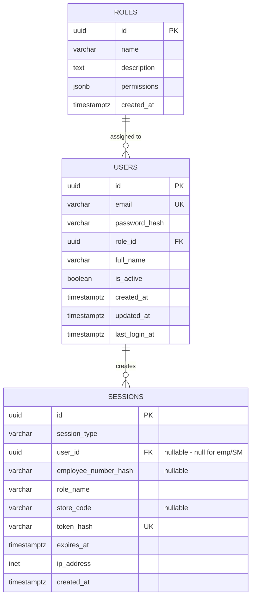
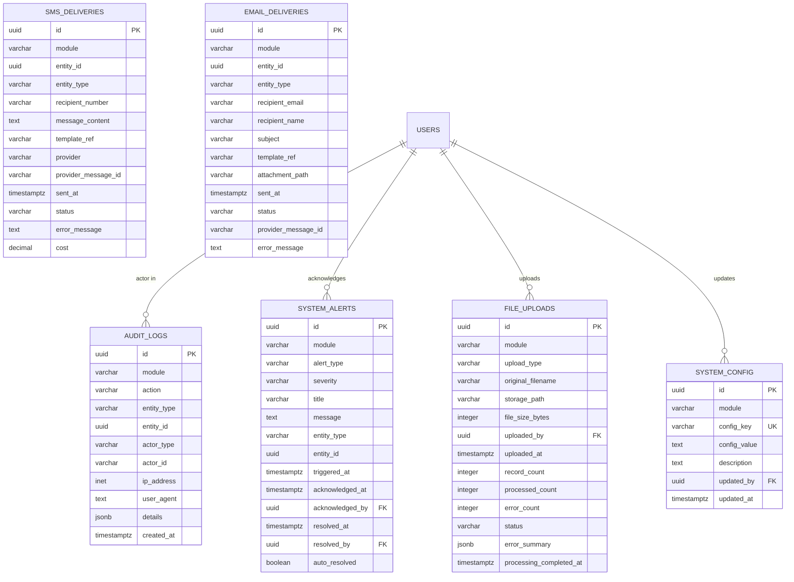

# 04 — Data Model & ERD

**Version:** 1.0  
**Date:** 2026-05-13

---

## Overview

The database is a single PostgreSQL 15 instance on Supabase. All tables live in one database, logically grouped by schema prefix in the table names. Relationships cross module boundaries only where genuinely shared (e.g. `users`, `audit_logs`, `file_uploads`).

Row-Level Security (RLS) is enabled at the Supabase level as a defence-in-depth measure. The primary access control layer is JWT role enforcement in the Fastify API.

---

## ERD 1 — Authentication & Admin Users



---

## ERD 2 — Module 1: Phone Rental Scheme

```mermaid
erDiagram
    WHITELIST_UPLOADS {
        uuid id PK
        varchar file_name
        varchar storage_path
        uuid uploaded_by FK
        timestamptz uploaded_at
        integer record_count
        integer valid_count
        integer error_count
        varchar status
    }

    WHITELIST_RECORDS {
        uuid id PK
        uuid upload_id FK
        varchar employee_number_hash
        varchar id_number_hash
        varchar display_name
        varchar place_of_work
        varchar store_code
        varchar employment_type
        varchar salary_band
        jsonb eligible_model_ids
        boolean is_current
        timestamptz created_at
    }

    PHONE_MODELS {
        uuid id PK
        varchar model_name
        varchar model_code
        decimal retail_price
        decimal rental_amount_7m
        decimal rental_amount_13m
        varchar min_salary_band
        varchar max_salary_band
        integer display_order
        boolean is_active
        timestamptz created_at
        timestamptz updated_at
    }

    STOCK_RECORDS {
        uuid id PK
        uuid phone_model_id FK
        integer quantity_on_hand
        integer quantity_reserved
        timestamptz last_updated_at
        uuid last_updated_by FK
    }

    OTP_EVENTS {
        uuid id PK
        varchar employee_number_hash
        varchar phone_number
        varchar otp_hash
        timestamptz sent_at
        timestamptz expires_at
        timestamptz verified_at
        integer attempts
        varchar status
    }

    APPLICATIONS {
        uuid id PK
        varchar reference_number UK
        varchar employee_number_hash
        varchar id_number_hash
        varchar employee_name
        varchar place_of_work
        varchar store_code
        varchar contact_number
        boolean contact_number_updated
        uuid phone_model_id FK
        integer rental_term
        boolean terms_accepted
        timestamptz terms_accepted_at
        varchar status
        uuid batch_id FK
        uuid superseded_by_id FK
        uuid otp_event_id FK
        boolean otp_verified
        timestamptz submitted_at
        timestamptz cancelled_at
        text cancellation_reason
        inet ip_address
    }

    BATCHES {
        uuid id PK
        date batch_month
        timestamptz cutoff_at
        varchar status
        integer total_applications
        integer valid_applications
        integer cancelled_applications
        integer rejected_applications
        uuid approved_by FK
        timestamptz approved_at
        timestamptz payroll_file_generated_at
        timestamptz orders_submitted_at
        jsonb processing_log
        timestamptz created_at
    }

    ORDERS {
        uuid id PK
        varchar order_number UK
        uuid application_id FK
        uuid batch_id FK
        varchar employee_number_hash
        varchar employee_name
        uuid phone_model_id FK
        integer rental_term
        varchar delivery_store_code
        varchar delivery_store_name
        varchar store_manager_email
        varchar status
        timestamptz teljoy_submitted_at
        varchar teljoy_reference
        timestamptz g3_submitted_at
        varchar g3_reference
        timestamptz wwas_submitted_at
        varchar wwas_reference
        timestamptz confirmation_sms_sent_at
        timestamptz store_notification_sent_at
        timestamptz created_at
    }

    RENTALS {
        uuid id PK
        uuid order_id FK
        varchar employee_number_hash
        uuid phone_model_id FK
        date start_date
        integer term_months
        decimal base_monthly_amount
        decimal current_monthly_amount
        decimal total_amount
        decimal amount_paid
        decimal amount_remaining
        integer payments_made
        integer payments_remaining
        varchar status
        boolean leaver_flag
        date leaver_date
        timestamptz leaver_notification_sent_at
        timestamptz teljoy_leaver_notified_at
        boolean end_of_term_purchase_eligible
        timestamptz created_at
        timestamptz updated_at
    }

    LEAVERS_UPLOADS {
        uuid id PK
        varchar file_name
        varchar storage_path
        uuid uploaded_by FK
        timestamptz uploaded_at
        integer record_count
        integer processed_count
        varchar status
    }

    LEAVERS_RECORDS {
        uuid id PK
        uuid upload_id FK
        varchar employee_number_hash
        varchar id_number_hash
        uuid matched_rental_id FK
        varchar processing_status
        timestamptz processed_at
    }

    STORE_MANAGER_UPLOADS {
        uuid id PK
        varchar file_name
        varchar storage_path
        uuid uploaded_by FK
        timestamptz uploaded_at
        integer record_count
        varchar status
    }

    STORE_MANAGERS {
        uuid id PK
        uuid upload_id FK
        varchar employee_number_hash
        varchar id_number_hash
        varchar display_name
        varchar store_code
        varchar store_name
        varchar email
        boolean is_current
        timestamptz created_at
    }

    DELIVERY_EVENTS {
        uuid id PK
        uuid order_id FK
        uuid store_manager_id FK
        varchar event_type
        timestamptz recorded_at
        text notes
    }

    PAY_AT_PAYMENTS {
        uuid id PK
        uuid rental_id FK
        varchar employee_number_hash
        varchar payment_reference
        decimal amount
        date payment_date
        timestamptz received_at
        timestamptz matched_at
        varchar status
        jsonb source_record
    }

    WHITELIST_UPLOADS ||--o{ WHITELIST_RECORDS : "contains"
    PHONE_MODELS ||--|| STOCK_RECORDS : "has stock"
    PHONE_MODELS ||--o{ APPLICATIONS : "applied for"
    BATCHES ||--o{ APPLICATIONS : "includes"
    APPLICATIONS ||--o| OTP_EVENTS : "verified by"
    APPLICATIONS ||--o| ORDERS : "becomes"
    APPLICATIONS ||--o| APPLICATIONS : "superseded by"
    BATCHES ||--o{ ORDERS : "contains"
    ORDERS ||--|| RENTALS : "creates"
    ORDERS ||--o{ DELIVERY_EVENTS : "has"
    ORDERS ||--o{ STORE_MANAGERS : "delivered at"
    STORE_MANAGER_UPLOADS ||--o{ STORE_MANAGERS : "contains"
    LEAVERS_UPLOADS ||--o{ LEAVERS_RECORDS : "contains"
    LEAVERS_RECORDS ||--o| RENTALS : "matches"
    RENTALS ||--o{ PAY_AT_PAYMENTS : "receives"
    PHONE_MODELS ||--o{ RENTALS : "rented as"
```



---

## ERD 3 — Module 2: Utility Bill Automation

```mermaid
erDiagram
    M2_STORES {
        uuid id PK
        varchar store_name
        varchar store_number
        varchar account_number UK
        varchar municipality
        varchar region
        varchar email_pattern
        boolean is_active
        text notes
        timestamptz added_at
        uuid added_by FK
        timestamptz deactivated_at
        uuid deactivated_by FK
    }

    MUNICIPALITY_FORMATS {
        uuid id PK
        varchar municipality_name
        varchar format_version
        jsonb parsing_rules
        varchar sample_bill_path
        boolean is_active
        integer store_count
        timestamptz created_at
        uuid created_by FK
        timestamptz updated_at
        uuid updated_by FK
    }

    BILLS {
        uuid id PK
        uuid store_id FK
        uuid municipality_format_id FK
        timestamptz email_received_at
        varchar email_sender
        varchar email_subject
        varchar original_filename
        varchar pdf_storage_path
        date billing_period_start
        date billing_period_end
        varchar utility_type
        boolean is_digital_pdf
        boolean ocr_applied
        decimal ocr_confidence
        varchar extraction_method
        varchar status
        text flagged_reason
        timestamptz processing_started_at
        timestamptz processing_completed_at
        timestamptz created_at
    }

    BILL_EXTRACTIONS {
        uuid id PK
        uuid bill_id FK
        timestamptz extracted_at
        varchar extraction_method
        varchar store_name
        varchar store_number
        varchar municipality_name
        varchar account_number
        date billing_period_start
        date billing_period_end
        varchar meter_number
        decimal previous_reading
        decimal current_reading
        decimal units_consumed
        decimal tariff_rate
        decimal amount_charged
        decimal vat_amount
        decimal total_due
        date due_date
        jsonb additional_fields
        jsonb field_positions
        varchar review_status
        uuid reviewed_by FK
        timestamptz reviewed_at
        text reviewer_notes
        varchar ai_model_used
        integer ai_prompt_tokens
        integer ai_completion_tokens
        decimal ai_cost_usd
        timestamptz created_at
    }

    EXCEL_OUTPUTS {
        uuid id PK
        uuid bill_id FK
        uuid extraction_id FK
        varchar file_name
        varchar storage_path
        timestamptz generated_at
        varchar generated_by
        varchar template_version
    }

    SUBMISSIONS {
        uuid id PK
        uuid bill_id FK
        uuid excel_output_id FK
        varchar submission_method
        timestamptz submitted_at
        varchar status
        varchar reference_number
        integer retry_count
        timestamptz last_retry_at
        timestamptz confirmed_at
        text error_message
        uuid submitted_by FK
    }

    M2_STORES ||--o{ BILLS : "receives"
    MUNICIPALITY_FORMATS ||--o{ BILLS : "format matched to"
    BILLS ||--o{ BILL_EXTRACTIONS : "produces"
    BILL_EXTRACTIONS ||--o| EXCEL_OUTPUTS : "generates"
    EXCEL_OUTPUTS ||--o| SUBMISSIONS : "submitted as"
```



---

## ERD 4 — Shared / Cross-Module



---

## Table Definitions — Full Field Reference

### `roles`

| Column | Type | Constraints | Notes |
|--------|------|-------------|-------|
| id | uuid | PK, default gen_random_uuid() | |
| name | varchar(50) | UNIQUE, NOT NULL | 'super_admin', 'm1_admin', 'm2_admin', 'm2_reviewer' |
| description | text | | Human-readable role description |
| permissions | jsonb | | Array of permission strings, future use |
| created_at | timestamptz | DEFAULT now() | |

---

### `users`

| Column | Type | Constraints | Notes |
|--------|------|-------------|-------|
| id | uuid | PK | |
| email | varchar(255) | UNIQUE, NOT NULL | Admin login identifier |
| password_hash | varchar(255) | NOT NULL | bcrypt hashed |
| role_id | uuid | FK → roles.id | |
| full_name | varchar(255) | NOT NULL | |
| is_active | boolean | DEFAULT true | Deactivation without deletion |
| failed_login_attempts | integer | DEFAULT 0 | Reset on successful login |
| locked_until | timestamptz | | Null unless locked |
| created_at | timestamptz | DEFAULT now() | |
| updated_at | timestamptz | | |
| last_login_at | timestamptz | | |

---

### `sessions`

| Column | Type | Constraints | Notes |
|--------|------|-------------|-------|
| id | uuid | PK | |
| session_type | varchar(20) | NOT NULL | 'admin', 'employee', 'store_manager' |
| user_id | uuid | FK → users.id, NULLABLE | Null for employee/store manager |
| employee_number_hash | varchar(255) | NULLABLE | For employee/SM sessions |
| role_name | varchar(50) | NOT NULL | Cached from role at login |
| store_code | varchar(20) | NULLABLE | For store manager sessions |
| token_hash | varchar(255) | UNIQUE, NOT NULL | Hash of the issued JWT |
| expires_at | timestamptz | NOT NULL | |
| ip_address | inet | | |
| created_at | timestamptz | DEFAULT now() | |
| revoked_at | timestamptz | NULLABLE | Set on logout or admin revocation |

---

### `whitelist_uploads`

| Column | Type | Constraints | Notes |
|--------|------|-------------|-------|
| id | uuid | PK | |
| file_name | varchar(255) | NOT NULL | Original filename |
| storage_path | varchar(500) | NOT NULL | Supabase storage path |
| uploaded_by | uuid | FK → users.id | |
| uploaded_at | timestamptz | DEFAULT now() | |
| record_count | integer | | Total rows in file |
| valid_count | integer | | Rows that passed validation |
| error_count | integer | | Rows that failed validation |
| status | varchar(20) | NOT NULL | 'processing', 'active', 'superseded', 'failed' |
| notes | text | | Error summary or admin notes |

---

### `whitelist_records`

| Column | Type | Constraints | Notes |
|--------|------|-------------|-------|
| id | uuid | PK | |
| upload_id | uuid | FK → whitelist_uploads.id | |
| employee_number_hash | varchar(255) | NOT NULL | bcrypt hashed |
| id_number_hash | varchar(255) | NOT NULL | bcrypt hashed |
| display_name | varchar(255) | NOT NULL | Plaintext — used for identity confirmation display only |
| place_of_work | varchar(255) | | Store/location name |
| store_code | varchar(20) | | Linked to store |
| employment_type | varchar(20) | | 'permanent', 'flexi' |
| salary_band | varchar(10) | NOT NULL | Used to determine phone eligibility |
| eligible_model_ids | jsonb | NOT NULL | Array of phone_models.id values |
| is_current | boolean | DEFAULT true | False after superseded by new upload |
| created_at | timestamptz | DEFAULT now() | |

---

### `phone_models`

| Column | Type | Constraints | Notes |
|--------|------|-------------|-------|
| id | uuid | PK | |
| model_name | varchar(100) | NOT NULL | 'Samsung A05', 'Samsung A07', etc. |
| model_code | varchar(50) | | Internal code |
| retail_price | decimal(10,2) | NOT NULL | |
| rental_amount_7m | decimal(10,2) | NOT NULL | Monthly rental over 7 months |
| rental_amount_13m | decimal(10,2) | NOT NULL | Monthly rental over 13 months |
| min_salary_band | varchar(10) | | Lowest band that qualifies |
| max_salary_band | varchar(10) | | Highest band for this model (if capped) |
| display_order | integer | DEFAULT 0 | Sort order in application form |
| is_active | boolean | DEFAULT true | Hidden if false |
| created_at | timestamptz | DEFAULT now() | |
| updated_at | timestamptz | | |

---

### `stock_records`

| Column | Type | Constraints | Notes |
|--------|------|-------------|-------|
| id | uuid | PK | |
| phone_model_id | uuid | FK → phone_models.id, UNIQUE | One row per model |
| quantity_on_hand | integer | NOT NULL DEFAULT 0 | Updated via file upload |
| quantity_reserved | integer | NOT NULL DEFAULT 0 | Increments on application, decrements on cancellation/rejection |
| last_updated_at | timestamptz | | |
| last_updated_by | uuid | FK → users.id | |

> **Note:** `quantity_available = quantity_on_hand - quantity_reserved` is computed in application logic, not stored.

---

### `applications`

| Column | Type | Constraints | Notes |
|--------|------|-------------|-------|
| id | uuid | PK | |
| reference_number | varchar(20) | UNIQUE, NOT NULL | Format: APP-YYYYMM-NNNNNN |
| employee_number_hash | varchar(255) | NOT NULL | |
| id_number_hash | varchar(255) | NOT NULL | |
| employee_name | varchar(255) | NOT NULL | Captured from whitelist at application time |
| place_of_work | varchar(255) | | |
| store_code | varchar(20) | | |
| contact_number | varchar(20) | | Confirmed/updated by employee |
| contact_number_updated | boolean | DEFAULT false | True if differs from whitelist |
| phone_model_id | uuid | FK → phone_models.id | |
| rental_term | integer | NOT NULL | 7 or 13 |
| terms_accepted | boolean | DEFAULT false | |
| terms_accepted_at | timestamptz | | |
| status | varchar(30) | NOT NULL | See status values below |
| batch_id | uuid | FK → batches.id, NULLABLE | Set when batch closes |
| superseded_by_id | uuid | FK → applications.id, NULLABLE | If employee reapplied |
| otp_event_id | uuid | FK → otp_events.id, NULLABLE | |
| otp_verified | boolean | DEFAULT false | |
| submitted_at | timestamptz | NOT NULL | |
| cancelled_at | timestamptz | NULLABLE | |
| cancellation_reason | text | NULLABLE | |
| ip_address | inet | | For fraud detection |

**Application status values:**
- `pending` — submitted, batch still open
- `cancelled_by_employee` — employee cancelled before cut-off
- `superseded` — employee submitted a newer application
- `cancelled_no_whitelist` — not on whitelist at batch time
- `cancelled_no_stock` — insufficient stock, cancelled by timestamp order
- `validated` — passed batch validation
- `converted_to_order` — order has been raised
- `rejected` — failed validation for another reason

---

### `batches`

| Column | Type | Constraints | Notes |
|--------|------|-------------|-------|
| id | uuid | PK | |
| batch_month | date | NOT NULL | First day of the month (e.g. 2025-05-01) |
| cutoff_at | timestamptz | NOT NULL | When the batch closed |
| status | varchar(30) | NOT NULL | See status values below |
| total_applications | integer | DEFAULT 0 | |
| valid_applications | integer | DEFAULT 0 | After whitelist check |
| cancelled_applications | integer | DEFAULT 0 | Stock + whitelist cancellations |
| rejected_applications | integer | DEFAULT 0 | |
| approved_by | uuid | FK → users.id, NULLABLE | |
| approved_at | timestamptz | NULLABLE | |
| payroll_file_generated_at | timestamptz | NULLABLE | |
| orders_submitted_at | timestamptz | NULLABLE | |
| processing_log | jsonb | | Step-by-step process audit trail |
| created_at | timestamptz | DEFAULT now() | |

**Batch status values:** `open`, `closed`, `processing`, `awaiting_approval`, `approved`, `orders_submitted`, `completed`

---

### `orders`

| Column | Type | Constraints | Notes |
|--------|------|-------------|-------|
| id | uuid | PK | |
| order_number | varchar(20) | UNIQUE | Format: ORD-YYYYMM-NNNNNN |
| application_id | uuid | FK → applications.id | |
| batch_id | uuid | FK → batches.id | |
| employee_number_hash | varchar(255) | NOT NULL | |
| employee_name | varchar(255) | | |
| phone_model_id | uuid | FK → phone_models.id | |
| rental_term | integer | | 7 or 13 |
| delivery_store_code | varchar(20) | | |
| delivery_store_name | varchar(255) | | |
| store_manager_email | varchar(255) | | Captured at order creation |
| status | varchar(30) | NOT NULL | See status values below |
| teljoy_submitted_at | timestamptz | NULLABLE | |
| teljoy_reference | varchar(100) | NULLABLE | |
| g3_submitted_at | timestamptz | NULLABLE | |
| g3_reference | varchar(100) | NULLABLE | |
| wwas_submitted_at | timestamptz | NULLABLE | |
| wwas_reference | varchar(100) | NULLABLE | |
| confirmation_sms_sent_at | timestamptz | NULLABLE | |
| store_notification_sent_at | timestamptz | NULLABLE | |
| created_at | timestamptz | DEFAULT now() | |

**Order status values:** `created`, `submitted_to_suppliers`, `acknowledged`, `dispatched`, `delivered_to_store`, `handed_to_employee`

---

### `rentals`

| Column | Type | Constraints | Notes |
|--------|------|-------------|-------|
| id | uuid | PK | |
| order_id | uuid | FK → orders.id, UNIQUE | One rental per order |
| employee_number_hash | varchar(255) | NOT NULL | |
| phone_model_id | uuid | FK → phone_models.id | |
| start_date | date | NOT NULL | Month of first deduction |
| term_months | integer | NOT NULL | 7 or 13 |
| base_monthly_amount | decimal(10,2) | NOT NULL | Original amount from catalogue |
| current_monthly_amount | decimal(10,2) | NOT NULL | May increase by R50 if leaver |
| total_amount | decimal(10,2) | | term_months × base_monthly_amount |
| amount_paid | decimal(10,2) | DEFAULT 0 | Updated by pay@ reconciliation |
| amount_remaining | decimal(10,2) | | Computed from total - paid |
| payments_made | integer | DEFAULT 0 | |
| payments_remaining | integer | NOT NULL | |
| status | varchar(20) | NOT NULL | 'active', 'leaver', 'completed', 'cancelled', 'written_off' |
| leaver_flag | boolean | DEFAULT false | |
| leaver_date | date | NULLABLE | |
| leaver_notification_sent_at | timestamptz | NULLABLE | |
| teljoy_leaver_notified_at | timestamptz | NULLABLE | |
| end_of_term_purchase_eligible | boolean | DEFAULT false | Set to true when payments_remaining = 0 |
| created_at | timestamptz | DEFAULT now() | |
| updated_at | timestamptz | | |

---

### `bills`

| Column | Type | Constraints | Notes |
|--------|------|-------------|-------|
| id | uuid | PK | |
| store_id | uuid | FK → m2_stores.id | |
| municipality_format_id | uuid | FK → municipality_formats.id, NULLABLE | Null until matched |
| email_received_at | timestamptz | NOT NULL | |
| email_sender | varchar(255) | | |
| email_subject | varchar(500) | | |
| original_filename | varchar(255) | | |
| pdf_storage_path | varchar(500) | NOT NULL | Supabase storage |
| billing_period_start | date | NULLABLE | Populated post-extraction |
| billing_period_end | date | NULLABLE | |
| utility_type | varchar(20) | NULLABLE | 'electricity', 'water', 'combined' |
| is_digital_pdf | boolean | NULLABLE | |
| ocr_applied | boolean | DEFAULT false | |
| ocr_confidence | decimal(5,2) | NULLABLE | 0–100 |
| extraction_method | varchar(20) | NULLABLE | 'parser', 'ai', 'manual' |
| status | varchar(30) | NOT NULL DEFAULT 'received' | See status values below |
| flagged_reason | text | NULLABLE | |
| processing_started_at | timestamptz | NULLABLE | |
| processing_completed_at | timestamptz | NULLABLE | |
| created_at | timestamptz | DEFAULT now() | |

**Bill status values:** `received`, `parsing`, `parsed`, `ocr_processing`, `awaiting_review`, `review_approved`, `excel_generated`, `emailed`, `submitted`, `failed`, `flagged`

---

### `bill_extractions`

| Column | Type | Constraints | Notes |
|--------|------|-------------|-------|
| id | uuid | PK | |
| bill_id | uuid | FK → bills.id | |
| extracted_at | timestamptz | NOT NULL | |
| extraction_method | varchar(20) | NOT NULL | 'parser', 'ai', 'manual' |
| store_name | varchar(255) | | |
| store_number | varchar(20) | | |
| municipality_name | varchar(255) | | |
| account_number | varchar(100) | | |
| billing_period_start | date | | |
| billing_period_end | date | | |
| meter_number | varchar(100) | | |
| previous_reading | decimal(12,2) | | |
| current_reading | decimal(12,2) | | |
| units_consumed | decimal(12,2) | | |
| tariff_rate | decimal(10,4) | | |
| amount_charged | decimal(10,2) | | |
| vat_amount | decimal(10,2) | | |
| total_due | decimal(10,2) | | |
| due_date | date | | |
| additional_fields | jsonb | | Extra fields beyond standard template |
| field_positions | jsonb | NULLABLE | PDF coordinates for review UI highlighting |
| review_status | varchar(20) | DEFAULT 'pending' | 'pending', 'approved', 'rejected', 'auto_approved' |
| reviewed_by | uuid | FK → users.id, NULLABLE | |
| reviewed_at | timestamptz | NULLABLE | |
| reviewer_notes | text | NULLABLE | |
| ai_model_used | varchar(100) | NULLABLE | |
| ai_prompt_tokens | integer | NULLABLE | |
| ai_completion_tokens | integer | NULLABLE | |
| ai_cost_usd | decimal(8,4) | NULLABLE | |
| created_at | timestamptz | DEFAULT now() | |

---

## System Configuration Keys

The `system_config` table stores all configurable system parameters. These are editable by Super Admin via the UI.

| config_key | module | default_value | description |
|------------ |--------|---------------|-------------|
| batch_cutoff_day | m1 | 9 | Day of month batch closes (night of) |
| batch_cutoff_hour | m1 | 23 | Hour (0–23) batch trigger fires |
| otp_expiry_minutes | m1 | 10 | OTP validity window |
| otp_max_attempts | m1 | 3 | Failed attempts before OTP locks |
| stock_warning_threshold | m1 | 20 | Alert when stock ≤ this % of applications |
| employee_session_hours | m1 | 4 | Employee session duration |
| store_mgr_session_hours | m1 | 8 | Store manager session duration |
| bill_missing_alert_days | m2 | 5 | Days before missing bill alert fires |
| bill_processing_sla_hours | m2 | 24 | Hours before unprocessed bill triggers alert |
| ai_auto_approve_enabled | m2 | false | Skip human review for AI extractions |
| ai_confidence_threshold | m2 | 90 | Min confidence % for auto-approve |
| weekly_report_day | shared | 1 | Day of week for M1 weekly report (1=Mon) |
| weekly_report_hour | shared | 7 | Hour weekly report fires |
| admin_session_minutes | shared | 15 | Admin JWT access token expiry |
| admin_refresh_days | shared | 7 | Admin refresh token validity |
| admin_max_failed_logins | shared | 5 | Login attempts before account lock |
| data_retention_days | shared | 1825 | Days to retain personal data (5 years) |

---

## Database Indexes

Key indexes for query performance:

```sql
-- Whitelist lookups (core hot path — every employee login)
CREATE INDEX idx_whitelist_records_hashes 
ON whitelist_records(employee_number_hash, id_number_hash) 
WHERE is_current = true;

-- Store manager lookups
CREATE INDEX idx_store_managers_hashes 
ON store_managers(employee_number_hash, id_number_hash) 
WHERE is_current = true;

-- Applications by employee (rental dashboard, duplicate check)
CREATE INDEX idx_applications_emp_hash 
ON applications(employee_number_hash) 
WHERE status NOT IN ('cancelled_by_employee', 'superseded');

-- Applications by batch
CREATE INDEX idx_applications_batch 
ON applications(batch_id, status);

-- Rentals by employee
CREATE INDEX idx_rentals_emp_hash 
ON rentals(employee_number_hash) 
WHERE status = 'active';

-- Bills by store + status
CREATE INDEX idx_bills_store_status 
ON bills(store_id, status);

-- Audit logs by module + created_at (for dashboard queries)
CREATE INDEX idx_audit_logs_module_created 
ON audit_logs(module, created_at DESC);

-- Sessions by token (every API call)
CREATE INDEX idx_sessions_token_hash 
ON sessions(token_hash) 
WHERE revoked_at IS NULL;
```
